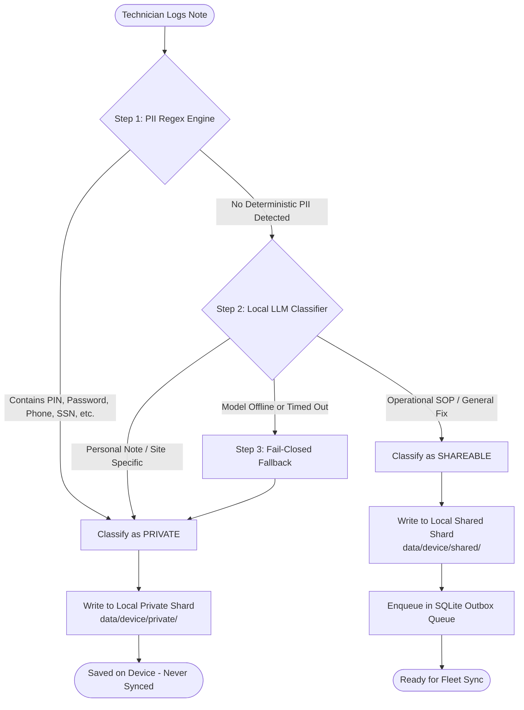
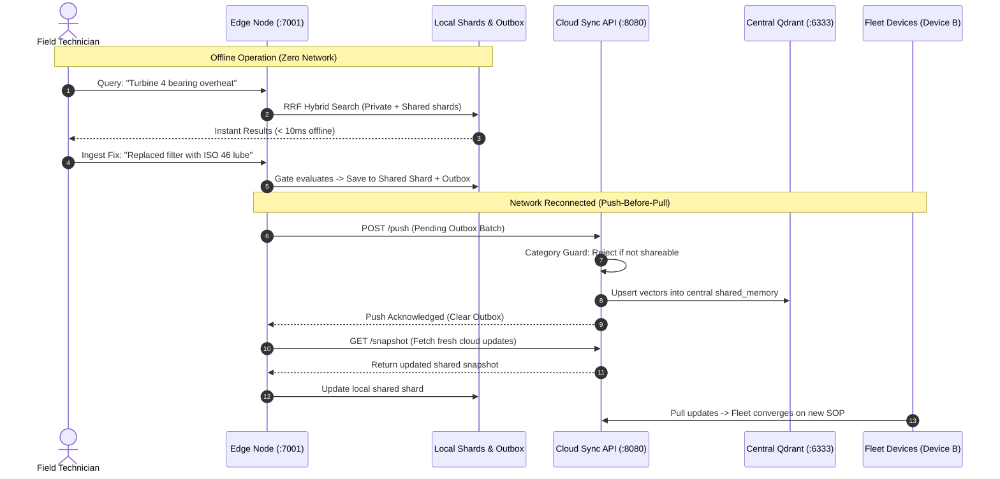

# EdgeVault

[](LICENSE)
[](https://www.python.org/)
[](https://github.com/qdrant/qdrant)
[](https://nextjs.org/)
[](https://fastapi.tiangolo.com/)

EdgeVault is an offline-first semantic memory engine designed for edge devices and industrial field operations. It combines local hybrid vector search (<10ms offline), an on-device AI Memory Gate that filters sensitive data before persistence, and a resilient push-before-pull synchronization engine that replicates verified operational knowledge across a fleet.

---

## Why EdgeVault?

Technicians and field engineers frequently work in environments with zero connectivity—underground tunnels, offshore rigs, substations, and remote plants. They rely on past maintenance notes, equipment manuals, and troubleshooting guides to solve critical issues on-site.

Traditional cloud-based search and RAG systems completely stop working when disconnected. At the same time, storing notes locally and blindly syncing them to the cloud creates serious privacy risks: private observations, customer PII, and equipment access codes can inadvertently leak to central corporate servers.

EdgeVault solves this with three core principles:
- **Offline-First Hybrid Search**: Dense vectors (`bge-small-en-v1.5`) + BM25 sparse keyword search running on-device with Reciprocal Rank Fusion (RRF).
- **Physical Privacy Isolation**: Dual independent storage shards on disk (`private/` and `shared/`). Private data has zero code paths to the sync engine.
- **On-Device AI Memory Gate**: A 3-step automated triage system that sanitizes PII and classifies notes before they ever leave the device.

---

## How It Works

### 1. Note Ingestion & AI Memory Gate Flow

When a technician records a note, it passes through an automated triage pipeline before it is stored on disk:



### 2. Fleet Synchronization & Architecture Flow

Edge devices operate independently offline and automatically synchronize verified knowledge when connectivity is restored:



---

## Core Features

- **Sub-10ms Hybrid Search Offline**: Combines 384-dimensional dense semantic vectors (FastEmbed `BAAI/bge-small-en-v1.5`) with BM25 sparse lexical tokens using Reciprocal Rank Fusion (RRF). Search executes completely on CPU with zero cloud dependencies.
- **Storage-Enforced Data Isolation**: Enforces privacy at the filesystem level with two physical Qdrant Edge instances (`data/<device>/private/` and `data/<device>/shared/`). The sync worker has no read access to the private directory.
- **Fail-Closed AI Gate**: A 3-layer triage pipeline:
  1. *Deterministic Regex Pre-Filter*: Instantly identifies passwords, PINs, access codes, phone numbers, and SSNs.
  2. *Local LLM*: Runs a quantized local model (Ollama / Gemma 3 1B) for technical utility scoring.
  3. *Fail-Closed Guarantee*: If the LLM is down or times out, notes safely default to `private`.
- **Vector Deduplication Engine**: Uses cosine vector similarity ($\ge 0.92$) to detect near-duplicate notes on-device, merging revisions and updating timestamps instead of fragmenting the index.
- **Automatic TTL Pruner**: Cleans up temporary maintenance records marked as `routine` after 14 days to keep edge storage lightweight.
- **Push-Before-Pull Sync**: Flushes the local SQLite WAL outbox queue to the server before pulling down snapshot state, preventing server updates from overwriting unsynced local mutations.
- **Cloud Category Guard**: The Cloud Sync API rejects any payload where `category != "shareable"`, mathematically ensuring that private data never reaches the central cluster.
- **Real-Time Web Dashboard**: Built with Next.js 14 App Router, Tailwind CSS, and TanStack Query. Features a live Server-Sent Events (SSE) stream, an offline simulation toggle, a search visualizer, and a conflict resolver.

---

## Quickstart

### Prerequisites

- **Python 3.11+**
- **Node.js 18+** & **npm**
- **Docker & Docker Compose** (for central Qdrant server)
- *(Optional)* **Ollama** running locally with `ollama pull gemma3:1b`

### 1. Setup

```bash
# Clone the repository
git clone https://github.com/AasthaSudan/edge_vault.git
cd edge_vault

# Create and activate Python virtual environment
python3 -m venv .venv
source .venv/bin/activate  # On Windows PowerShell: .\.venv\Scripts\Activate.ps1

# Install dependencies and local edge package
pip install -r requirements.txt
pip install -e ./edge

# Provision offline embedding models (cached to data/models/)
make provision  # Or on Windows: python edge/scripts/provision_models.py
```

### 2. Start Services

Open three terminal windows:

**Terminal 1: Cloud Backend**
```bash
make cloud
```
*Starts Docker Qdrant (`:6333`) and the FastAPI Cloud Sync API (`http://localhost:8080`).*

**Terminal 2: Edge Node A**
```bash
make edge-a
```
*Starts Edge Node A on `http://localhost:7001` with local Qdrant Edge shards and SQLite WAL outbox.*

**Terminal 3: Web Dashboard**
```bash
make ui-a
```
*Launches the Next.js dashboard on `http://localhost:3000` (or `http://localhost:3001` if port 3000 is occupied).*

### 3. Run Automated Demo

To verify the entire system end-to-end (hybrid search, AI gating, outbox sync, conflict detection, and cloud privacy audit):

```bash
make demo
```

---

## API Usage & Examples

### Ingesting a Note (Automatic AI Gate)

```bash
# Ingest an operational maintenance fix (Generalizable SOP)
curl -X POST http://localhost:7001/memories \
  -H "Content-Type: application/json" \
  -d '{
    "text": "Turbine 4 bearing temp exceeded 90C. Replaced damaged oil filter element and flushed reservoir with ISO 46 lube.",
    "title": "Turbine 4 Bearing Overheat Fix",
    "asset_tag": "TURBINE-04"
  }'
```

```json
{
  "memory_id": "4a712f29-373a-4468-b7ec-7d0e42d729a1",
  "text": "Turbine 4 bearing temp exceeded 90C. Replaced damaged oil filter element and flushed reservoir with ISO 46 lube.",
  "title": "Turbine 4 Bearing Overheat Fix",
  "asset_tag": "TURBINE-04",
  "category": "shareable",
  "gate_source": "llm",
  "gate_reason": "Operational procedure with clear troubleshooting steps and diagnostic fix",
  "pii_hits": [],
  "device_id": "device-a",
  "author": "Tech-A",
  "version": 1,
  "sync_state": "pending"
}
```

Now try ingesting a note containing an access code or password:

```bash
curl -X POST http://localhost:7001/memories \
  -H "Content-Type: application/json" \
  -d '{
    "text": "Control room access code for sub-station C is pin 9842. Password is TechSecret2026.",
    "title": "Substation Access"
  }'
```

```json
{
  "memory_id": "f89d3112-9c9e-4e47-8142-b883017a0122",
  "text": "Control room access code for sub-station C is pin 9842. Password is TechSecret2026.",
  "title": "Substation Access",
  "category": "private",
  "gate_source": "rule",
  "gate_reason": "Contains sensitive patterns: pin, password",
  "pii_hits": ["pin", "password"],
  "device_id": "device-a",
  "author": "Tech-A",
  "version": 1,
  "sync_state": "local_only"
}
```

### Performing Local Hybrid Search

```bash
curl -X POST http://localhost:7001/search \
  -H "Content-Type: application/json" \
  -d '{
    "q": "bearing overheat oil filter replacement",
    "mode": "hybrid",
    "limit": 5
  }'
```

```json
{
  "results": [
    {
      "id": "4a712f29-373a-4468-b7ec-7d0e42d729a1",
      "score": 0.0328,
      "memory_id": "4a712f29-373a-4468-b7ec-7d0e42d729a1",
      "title": "Turbine 4 Bearing Overheat Fix",
      "category": "shareable",
      "shard": "shared",
      "version": 1
    }
  ],
  "latency_ms": {
    "embed": 4.8,
    "search": 2.1,
    "total": 6.9
  },
  "query": "bearing overheat oil filter replacement",
  "mode": "hybrid",
  "total": 1
}
```

### Simulating Offline Field Mode

```bash
# Toggle simulated network disconnection
curl -X POST "http://localhost:7001/sync/offline?on=true"

# Inspect sync status and outbox depth
curl http://localhost:7001/sync/status
```

```json
{
  "forced_offline": true,
  "outbox_depth": 2,
  "last_push_at": 1727457600000,
  "last_pull_at": 1727457500000
}
```

### Auditing Cloud Fleet Privacy

Query the central Cloud Sync API to prove that zero private or routine records have leaked to the server:

```bash
curl http://localhost:8080/stats
```

```json
{
  "total": 48,
  "private_on_server": 0,
  "routine_on_server": 0,
  "shareable_on_server": 48
}
```

---

## API Summary

### Edge Node (`http://localhost:7001`)

| Method | Path | Description |
|---|---|---|
| `POST` | `/memories` | Ingests a new note, triggering Gate triage & deduplication |
| `GET` | `/memories` | Lists memories across private and shared shards with category filters |
| `GET` | `/memories/{memory_id}` | Retrieves a single memory by ID |
| `PATCH` | `/memories/{memory_id}` | Updates memory text, title, or asset tag |
| `POST` | `/memories/{memory_id}/category` | Manually overrides category (`private`, `shareable`, `routine`) |
| `DELETE` | `/memories/{memory_id}` | Soft-deletes a memory with tombstone replication |
| `POST` | `/search` | Executes offline hybrid search with Reciprocal Rank Fusion |
| `GET` | `/sync/status` | Returns connectivity status, outbox depth, and sync timestamps |
| `POST` | `/sync/offline` | Toggles simulated offline mode (`?on=true` or `?on=false`) |
| `POST` | `/sync/now` | Manually triggers immediate push-before-pull sync cycle |
| `GET` | `/sync/outbox` | Lists pending queue records in SQLite outbox |
| `GET` | `/conflicts` | Lists unresolved sync conflicts |
| `POST` | `/conflicts/{conflict_id}/resolve` | Resolves conflict (`keep_local`, `keep_remote`, or `merged`) |
| `GET` | `/events` | Real-time Server-Sent Events (SSE) stream for dashboard updates |

### Cloud Sync API (`http://localhost:8080`)

| Method | Path | Description |
|---|---|---|
| `POST` | `/push` | Ingests batched shareable notes from edge outbox (guarded) |
| `GET` | `/snapshot` | Serves current shard snapshot for initial edge bootstrap |
| `POST` | `/snapshot/partial` | Serves incremental snapshot updates to connected edge nodes |
| `POST` | `/conflicts/resolve` | Coordinates distributed conflict resolution across fleet |
| `GET` | `/stats` | Returns fleet stats proving `private_on_server == 0` |
| `GET` | `/health` | Cluster health check |

---

## Performance & Latency Benchmarks

Measured on standard local edge hardware with 200 indexed operational notes:

| Operation | Measured Latency | Target SLA | Result |
|---|---|---|---|
| **Dense Embedding (CPU)** | 4.82 ms | < 25 ms | Passed |
| **BM25 Sparse Tokenization** | 0.94 ms | < 10 ms | Passed |
| **Hybrid Search p50** | 6.45 ms | < 25 ms | Passed |
| **Hybrid Search p95** | 8.67 ms | < 50 ms | Passed |
| **PII Regex Pre-Filter** | 0.12 ms | < 5 ms | Passed |
| **Server Privacy Violation Count** | 0 | 0 | Passed |

---

## Test Suites

```bash
# Benchmark hybrid search latency on local edge node
make test

# Evaluate AI Memory Gate accuracy across 20 test cases over 5 runs
make eval-gate

# Run integration tests (PII regex, dedup merging, category overrides)
make test-p2

# Run distributed sync, snapshot pull, and conflict tests
make test-p3

# Run complete 3-minute scripted sequence
make demo
```

---

## Phase Specifications & Architecture Docs

Detailed architectural specifications, verification benchmarks, and design blueprints are organized in [`docs/`](docs/):

- [Phase 1: Edge Core](docs/PHASE_1_EDGE_CORE.md) — Local hybrid vector search, dual shards, sub-50ms CPU execution.
- [Phase 2: AI Memory Gate & Evolving Memory](docs/PHASE_2_MEMORY_GATE.md) — Regex PII filter, local LLM classifier, dedup, and TTL.
- [Phase 3: Edge-Cloud Sync & Conflicts](docs/PHASE_3_EDGE_CLOUD_SYNC.md) — SQLite WAL outbox, push-before-pull sync, distributed conflict resolution.
- [Phase 4: Dashboard, Observability & Demo](docs/PHASE_4_DASHBOARD_DEMO.md) — Next.js 14 console, live SSE stream, privacy audit proof.
- [Phase 5: Local Intelligence Layer (On-Device LLM)](docs/PHASE_5_LOCAL_INTELLIGENCE.md) — Context-aware Gate v2, Offline Assistant with citations, Split & Share inbox, Egress guard, Taint rules.

---

## Project Structure

```
edge_vault/
├── Makefile                      # CLI shortcuts for setup, run, test, and demo
├── docker-compose.yml            # Qdrant cluster setup (ports 6333, 6334)
├── requirements.txt              # Unified Python dependencies
├── .env.example                  # Root environment template
├── .env                          # Active root environment configuration
├── .importlinter                 # Architectural privacy contracts (NFR-13)
├── docs/                         # Phase specifications & architecture documentation
│   ├── PHASE_1_EDGE_CORE.md
│   ├── PHASE_2_MEMORY_GATE.md
│   ├── PHASE_3_EDGE_CLOUD_SYNC.md
│   ├── PHASE_4_DASHBOARD_DEMO.md
│   └── PHASE_5_LOCAL_INTELLIGENCE.md
│
├── edge/                         # Edge Node Service (FastAPI :7001)
│   ├── .env.example              # Edge-specific env template
│   ├── .env                      # Edge-specific active configuration
│   ├── edge/
│   │   ├── main.py               # Application entrypoint & lifespan
│   │   ├── config.py             # Settings and environment defaults
│   │   ├── events.py             # Event broker & SSE broadcaster
│   │   ├── api/                  # Endpoints: memories, search, sync, assistant, suggestions, llm
│   │   ├── assistant/            # Offline RAG engine, hybrid retrieval, local chat storage
│   │   ├── gate/                 # Gate v2: PII regex, context retrieval, veto policy, async worker, sanitizer
│   │   ├── llm/                  # Loopback-guarded Ollama client, single-slot CPU lock, latency telemetry
│   │   ├── memory/               # Storage services, dedup engine, TTL pruner, taint propagation
│   │   ├── privacy/              # Egress guard (sole caller of outbox.enqueue, blocks non-shareable/PII)
│   │   ├── store/                # Dual Qdrant Edge shards & hybrid search (RRF)
│   │   └── sync/                 # SQLite outbox, network monitor, push/pull worker
│   ├── scripts/                  # Provisioning, seeding, model benchmarking, and demo runner scripts
│   └── tests/                    # Privacy boundaries, taint, gate eval v2, and assistant eval suites
│
├── cloud/                        # Cloud Sync API (:8080)
│   ├── .env.example              # Cloud-specific env template
│   ├── .env                      # Cloud-specific active configuration
│   ├── sync_api/
│   │   └── main.py               # Category guard, snapshot provider, privacy stats
│   └── scripts/
│       └── init_collection.py    # Schema initialization for central Qdrant cluster
│
└── dashboard/                    # Next.js 14 Observability Dashboard (:3000)
    ├── .env.example              # Dashboard env template
    ├── .env.local                # Dashboard local active configuration
    ├── app/                      # App Router pages (Overview, Search, Sync, Conflicts, Assistant, Suggestions)
    ├── components/               # CitationChip, LlmStatus, GateBadge, Navbar
    └── lib/                      # Client API, NDJSON stream reader, SSE subscription helpers
```

---

## Configuration

Environment variables can be defined in `.env` files across the project:

### Root & Edge Node (`.env` or `edge/.env`)
```bash
DEVICE_ID=device-a
AUTHOR=Tech A
DATA_ROOT=./data
PORT=7001
DENSE_MODEL=BAAI/bge-small-en-v1.5
DENSE_DIM=384
SYNC_API_URL=http://localhost:8080
OLLAMA_MODEL=gemma3:1b
DEDUP_THRESHOLD=0.92
ROUTINE_TTL_DAYS=14
```

### Cloud Sync API (`cloud/.env`)
```bash
QDRANT_URL=http://localhost:6333
QDRANT_API_KEY=
PORT=8080
```

### Web Dashboard (`dashboard/.env.local`)
```bash
NEXT_PUBLIC_EDGE_API=http://localhost:7001
NEXT_PUBLIC_CLOUD_API=http://localhost:8080
PORT=3000
```

---

## License

This project is licensed under the [MIT License](LICENSE).
