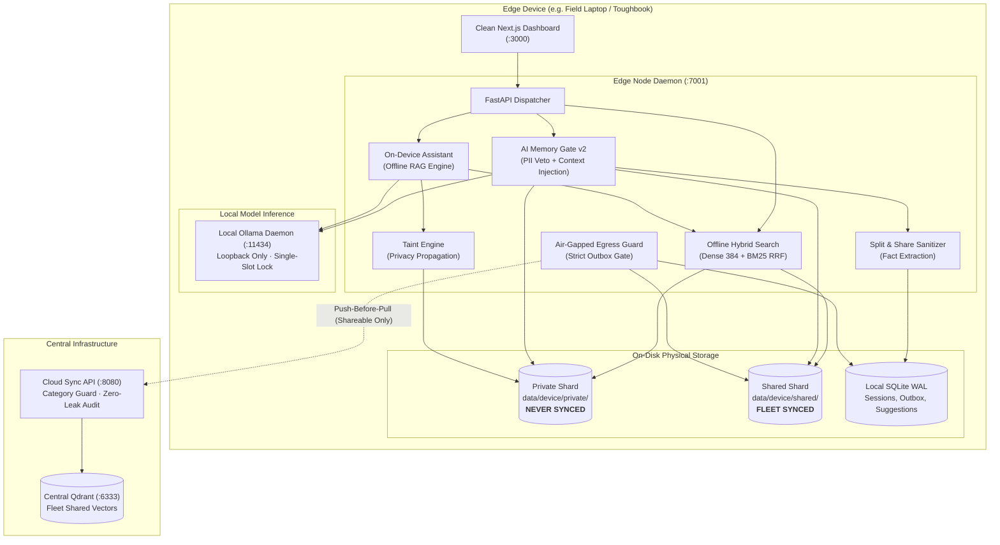
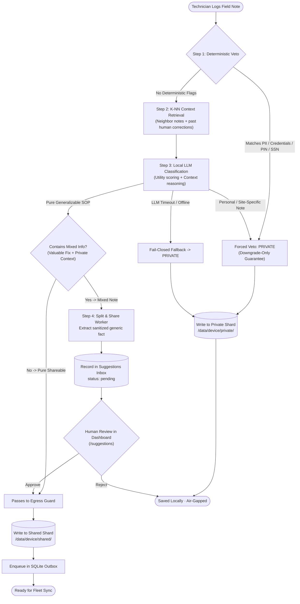
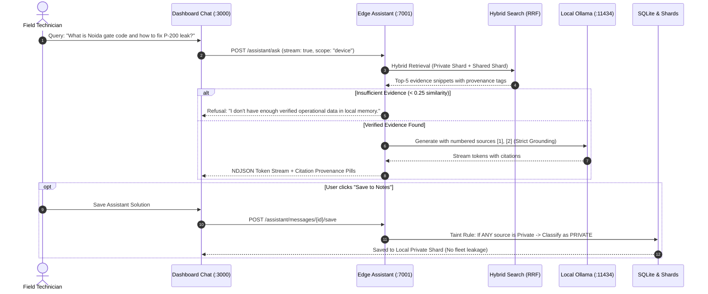
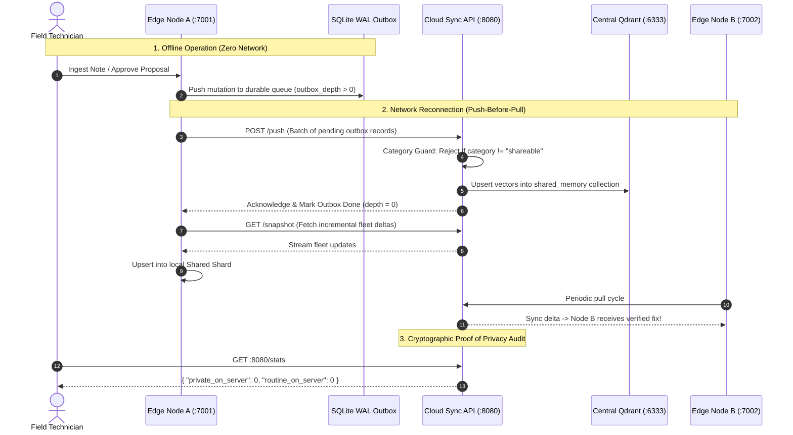

# EdgeVault

[](LICENSE)
[](https://www.python.org/)
[](https://github.com/qdrant/qdrant)
[](https://nextjs.org/)
[](https://fastapi.tiangolo.com/)

EdgeVault is an offline-first semantic memory engine designed for edge devices and industrial field operations. It combines local hybrid vector search (<10ms offline), an on-device AI Memory Gate that filters sensitive data before persistence, and a resilient push-before-pull synchronization engine that replicates verified operational knowledge across a fleet.

---

## Why EdgeVault?

Technicians and field engineers frequently work in environments with zero connectivity—underground tunnels, offshore rigs, substations, and remote plants. They rely on past maintenance notes, equipment manuals, and troubleshooting guides to solve critical issues on-site.

Traditional cloud-based search and RAG systems completely stop working when disconnected. At the same time, storing notes locally and blindly syncing them to the cloud creates serious privacy risks: private observations, customer PII, and equipment access codes can inadvertently leak to central corporate servers.

EdgeVault solves this with three core principles:
- **Offline-First Hybrid Search**: Dense vectors (`bge-small-en-v1.5`) + BM25 sparse keyword search running on-device with Reciprocal Rank Fusion (RRF).
- **Physical Privacy Isolation**: Dual independent storage shards on disk (`private/` and `shared/`). Private data has zero code paths to the sync engine.
- **On-Device AI Memory Gate**: A 3-step automated triage system that sanitizes PII and classifies notes before they ever leave the device.

---

## System Architecture & How It Works

EdgeVault is structured around strict physical air-gaps on-device, local generative intelligence, and cryptographic privacy guarantees:



---

### 1. Gate v2 & Split & Share Triage Pipeline

When an operational note is ingested, it undergoes deterministic inspection, K-NN context enrichment, local model classification, and automatic split-and-share sanitization:



---

### 2. On-Device Assistant (Offline RAG with Citations)

The offline assistant enables field technicians to query equipment procedures with verified, numbered citations and strict privacy boundary preservation:



---

### 3. Fleet Synchronization & Cloud Privacy Audit

Edge devices operate independently while disconnected and safely synchronize when connectivity is established:



---

## Core Features

- **Offline-First Hybrid Search (<10ms)**: Combines 384-dimensional dense semantic vectors (FastEmbed `BAAI/bge-small-en-v1.5`) with BM25 sparse keyword search using Reciprocal Rank Fusion (RRF). Search executes 100% on CPU with zero cloud dependencies.
- **Physical Privacy Sharding**: Enforces privacy at the filesystem level with two isolated Qdrant Edge instances (`data/<device>/private/` and `data/<device>/shared/`). Private notes have zero physical pathways to networking code.
- **On-Device Assistant (Local RAG)**: Answers technical questions completely offline with verifiable numbered citations (`[1] Fleet`, `[2] Private`). Refuses to hallucinate when context is missing and maintains local chat session history in SQLite.
- **AI Memory Gate v2**:
  - *Deterministic Downgrade Vetoes*: Regex patterns immediately veto access codes, PINs, passwords, and phone numbers to `private`. Rules can downgrade classifications, but the LLM can never upgrade a rule veto.
  - *Neighbor & Historical Context*: Injects K-nearest neighbors and past human correction overrides into triage prompts for superior consistency.
  - *Fast-Path Persistence*: Notes persist locally within ~5ms; asynchronous background workers classify and upgrade records without blocking UI threads.
- **Split & Share Review Workflow**: Automatically detects mixed notes (e.g. gate codes + pump repairs), sanitizes out the private credentials, and queues a proposed generic troubleshooting fact in the `/suggestions` review inbox for one-click technician approval.
- **Taint Tracking Engine**: Prevents privacy leakage when saving assistant-generated knowledge: if an answer cited any private note, the resulting saved memory is strictly tainted as `private`.
- **Air-Gapped Egress Firewall**: A single dedicated module (`edge/privacy/egress.py`) controls queueing into the network outbox. Architectural import linters (`.importlinter`) verify that private storage modules are never imported by synchronization modules.
- **Vector Deduplication Engine**: Uses cosine similarity ($\ge 0.92$) to detect near-duplicate notes on-device, merging revisions and updating timestamps instead of fragmenting the index.
- **Automatic TTL Pruner**: Cleans up temporary maintenance records marked as `routine` after 14 days to keep edge storage lightweight.
- **Push-Before-Pull Synchronization**: Flushes the local SQLite WAL outbox queue to the server before pulling down snapshot state, preventing server updates from overwriting unsynced local mutations.
- **Cloud Category Guard**: The Cloud Sync API rejects any payload where `category != "shareable"`, mathematically ensuring that private data never reaches the central cluster.
- **AI Conflict Reconciliation**: When two devices' edits collide, the on-device LLM explains in one sentence whether it is a *progression over time* ("normal on Mon, leaking on Wed"), a *genuine contradiction* (25 Nm vs 20 Nm) or the *same fact reworded*, and recommends a resolution. Deterministic checks catch differing values and opposite instructions the small model misses; the technician still decides.
- **Cross-Device Corroboration ("Fleet Verified")**: When independent devices report the same fact about the same asset, the cloud links the notes and marks them `fleet_verified` with the reporting devices. Reports with different values or opposite wording are never counted as agreement. The assistant states verification from data: "[1] is fleet verified: reported independently by 2 devices".
- **Deployment-Ready Cloud**: Fleet API key on all data endpoints, explicit CORS, production mode that refuses insecure config, non-root Docker image with health checks, and a production compose file.
- **Clean Enterprise Dashboard**: Built with Next.js 14 App Router and Tailwind CSS. Features an executive dark slate palette, 32px engineering grid overlay, zero neon clutter, live Server-Sent Events (SSE) stream, and an offline network simulation toggle.

---

## Quickstart

### Prerequisites

- **Python 3.11+**
- **Node.js 18+** & **npm**
- **Docker & Docker Compose** (for central Qdrant server)
- *(Optional, for the on-device AI)* **Ollama** running locally with `ollama pull qwen2.5:1.5b` or `ollama pull gemma3:1b`

### 1. Setup

```bash
# Clone the repository
git clone https://github.com/AasthaSudan/edge_vault.git
cd edge_vault

# Create and activate Python virtual environment
python3 -m venv .venv
source .venv/bin/activate  # On Windows PowerShell: .\.venv\Scripts\Activate.ps1

# Install dependencies and local edge package
pip install -r requirements.txt
pip install -e ./edge

# Provision offline embedding models (cached to data/models/)
make provision  # Or: python edge/scripts/provision_models.py
```

### 2. Start Services

Open three terminal windows:

**Terminal 1: Cloud Backend**
```bash
make cloud
```
*Starts Docker Qdrant (`:6333`) and the FastAPI Cloud Sync API (`http://localhost:8080`).*

**Terminal 2: Edge Node A**
```bash
make edge-a
```
*Starts Edge Node A on `http://localhost:7001` with local Qdrant Edge shards and SQLite WAL outbox.*

**Terminal 3: Web Dashboard**
```bash
make ui-a
```
*Launches the clean Next.js dashboard on `http://localhost:3000`.*

---

## Interactive API Examples & Verification Flow

### 1. Ingesting a Note with Gate v2 Triage

```bash
# Ingest an operational maintenance fix (Generalizable SOP -> Shareable)
curl -X POST http://localhost:7001/memories \
  -H "Content-Type: application/json" \
  -d '{
    "text": "Turbine 4 bearing temp exceeded 90C. Replaced damaged oil filter element and flushed reservoir with ISO 46 lube.",
    "title": "Turbine 4 Bearing Overheat Fix",
    "asset_tag": "TURBINE-04"
  }'
```

```json
{
  "memory_id": "4a712f29-373a-4468-b7ec-7d0e42d729a1",
  "category": "shareable",
  "gate_source": "llm",
  "gate_reason": "Operational procedure with clear troubleshooting steps and diagnostic fix",
  "sync_state": "pending"
}
```

Now try ingesting a note containing an access code or password:

```bash
curl -X POST http://localhost:7001/memories \
  -H "Content-Type: application/json" \
  -d '{
    "text": "Control room access code for sub-station C is pin 9842. Password is TechSecret2026.",
    "title": "Substation Access"
  }'
```

```json
{
  "memory_id": "f89d3112-9c9e-4e47-8142-b883017a0122",
  "category": "private",
  "gate_source": "rule",
  "gate_reason": "Deterministic veto: matches credential pattern",
  "pii_hits": ["pin", "password"],
  "sync_state": "local_only"
}
```

---

### 2. Querying the On-Device Assistant (Local RAG)

Query the local assistant. The response is always a stream of newline-delimited JSON (NDJSON, `application/x-ndjson`), one event per line, each with a `type`. The assistant cites verified numbered sources `[1] Fleet`, `[2] Private`:

```bash
curl -N -X POST http://localhost:7001/assistant/ask \
  -H "Content-Type: application/json" \
  -d '{
    "question": "How did we fix the turbine 4 bearing overheat?",
    "scope": "device"
  }'
```

`session_id` (optional) continues an earlier conversation; `scope` is `device` or `fleet`. Streaming output:
```text
{"type":"sources","session_id":"s-01","sources":[{"n":1,"title":"Turbine 4 Bearing Overheat Fix","category":"shareable","memory_id":"4a712f29-..."}],"retrieve_ms":7.1}
{"type":"token","text":"To fix the Turbine 4 bearing overheat, replace the damaged oil filter element"}
{"type":"token","text":" and flush the reservoir with ISO 46 lubricant [1]."}
{"type":"done","message_id":"msg-42","text":"To fix the Turbine 4 bearing overheat, ... [1].","cited_ns":[1],"cited":["4a712f29-..."],"grounded":true,"attributed":false,"replaced":null,"latency_ms":{"retrieve":7.1,"first_token":120.4,"total":480.2}}
```

The `done.text` is the final answer and can differ from the concatenated `token` events (citations attributed, an ungrounded answer replaced by the refusal, or the extractive fallback used when the local model fails). Clients should display `done.text`.

---

### 3. Reviewing & Approving Split & Share Proposals

When a mixed note is ingested (e.g. gate code + pump fix), the private original stays isolated on-device while a sanitized fact is queued for review:

```bash
# List pending Split & Share proposals
curl http://localhost:7001/suggestions?status=pending

# Approve proposal for fleet replication
curl -X POST http://localhost:7001/suggestions/<PROPOSAL_ID>/approve \
  -H "Content-Type: application/json" \
  -d '{"text": "P-200 cavitation resolved by clearing suction strainer mesh."}'
```

---

### 4. Simulating Offline Field Mode

```bash
# Toggle simulated network disconnection
curl -X POST "http://localhost:7001/sync/offline?on=true"

# Inspect sync status and outbox depth
curl http://localhost:7001/sync/status
```

```json
{
  "forced_offline": true,
  "outbox_depth": 2,
  "last_push_at": 1727457600000,
  "last_pull_at": 1727457500000
}
```

---

### 5. Auditing Central Cloud Privacy

Query the central Cloud Sync API to prove that zero private or routine records have leaked to the server:

```bash
curl http://localhost:8080/stats
```

```json
{
  "total": 48,
  "private_on_server": 0,
  "routine_on_server": 0,
  "shareable_on_server": 48
}
```

---

## API Summary

### Edge Node (`http://localhost:7001`)

| Method | Path | Description |
|---|---|---|
| `POST` | `/memories` | Ingests a new note, triggering Gate v2 triage & deduplication |
| `GET` | `/memories` | Lists memories across private and shared shards with category filters |
| `GET` | `/memories/{memory_id}` | Retrieves a single memory by ID |
| `PATCH` | `/memories/{memory_id}` | Updates memory text, title, or asset tag |
| `POST` | `/memories/{memory_id}/category` | Manually overrides category (`private`, `shareable`, `routine`); refuses `shareable` if the note matches a PII rule |
| `POST` | `/memories/{memory_id}/reclassify` | Re-runs Gate v2 on a note that fell back to private while the LLM was unavailable |
| `DELETE` | `/memories/{memory_id}` | Soft-deletes a memory with tombstone replication |
| `POST` | `/search` | Executes offline hybrid search with Reciprocal Rank Fusion |
| `POST` | `/assistant/ask` | Queries on-device assistant; streams NDJSON events (`sources`, `token`, `done`) with numbered citations |
| `GET` | `/assistant/sessions` | Lists local chat sessions |
| `DELETE` | `/assistant/sessions/{sid}` | Deletes a local chat session |
| `POST` | `/assistant/messages/{id}/save` | Saves assistant answer as memory with automatic taint tracking |
| `GET` | `/suggestions` | Lists pending Split & Share proposals (`?status=pending`) |
| `POST` | `/suggestions/{id}/approve` | Approves sanitized fact for fleet replication (new memory, `gate_source=user_approved`; edits are re-checked for PII, grounding and numbers) |
| `POST` | `/suggestions/{id}/reject` | Keeps original private and archives proposal |
| `GET` | `/llm/status` | Checks local Ollama model readiness, warmup state, and p95 latency |
| `GET` | `/sync/status` | Returns connectivity status, outbox depth, and sync timestamps |
| `POST` | `/sync/offline` | Toggles simulated offline mode (`?on=true` or `?on=false`) |
| `POST` | `/sync/now` | Manually triggers immediate push-before-pull sync cycle |
| `GET` | `/sync/outbox` | Lists pending queue records in SQLite outbox |
| `GET` | `/conflicts` | Lists unresolved sync conflicts |
| `POST` | `/conflicts/{conflict_id}/analyze` | On-device LLM reconciliation: `progression` / `contradiction` / `same_fact` + recommended resolution (cached; `?refresh=true` recomputes) |
| `POST` | `/conflicts/{conflict_id}/resolve` | Resolves conflict (`keep_local`, `keep_remote`, or `merged`) |
| `GET` | `/events` | Real-time Server-Sent Events (SSE) stream for dashboard updates |

### Cloud Sync API (`http://localhost:8080`)

| Method | Path | Description |
|---|---|---|
| `POST` | `/push` | Ingests batched shareable notes from edge outbox (guarded; links corroborating reports from other devices) |
| `GET` | `/snapshot` | Serves current shard snapshot for initial edge bootstrap |
| `POST` | `/snapshot/partial` | Serves incremental snapshot updates to connected edge nodes |
| `GET` | `/pull/records` | Paged delta sync keyed on the server clock (`server_ts`); edges page with `next_offset` and resume from `server_now` |
| `POST` | `/conflicts/resolve` | Coordinates distributed conflict resolution across fleet |
| `GET` | `/stats` | Returns fleet stats proving `private_on_server == 0`, plus `fleet_verified_on_server` (public) |
| `GET` | `/health` | Liveness + Qdrant reachability (public) |

All cloud endpoints except `/health` and `/stats` require `Authorization: Bearer <FLEET_API_KEY>` when the key is set (always in production).

---

## Verification & Test Benchmarks

```bash
# Benchmark hybrid search latency on local edge node (<10ms target)
make test

# Evaluate Gate v2 accuracy (95% accuracy, 0 false shareables)
make eval-gate
# or: PYTHONPATH=edge python edge/tests/eval_gate.py

# Evaluate On-Device Assistant (100% citation validity, 100% refusal)
make eval-assistant
# or: PYTHONPATH=edge python edge/tests/eval_assistant.py

# Evaluate on-device conflict reconciliation (progression / contradiction / same fact)
make eval-reconcile

# The whole unit suite CI runs: privacy boundaries, taint, durability, gate, PII rules,
# note lifecycle (retraction, async-gate races, TTL, paging), API hardening. Needs no Ollama.
make test-unit
# or a single file: PYTHONPATH=edge pytest edge/tests/test_privacy_boundaries.py

# Privacy import contract: the sync layer can never import the LLM, assistant or gate context
make lint-imports

# Edge-cloud sync integration (push/pull, conflicts, tombstones, contradictions). Needs a cloud API + Qdrant.
# It pushes test notes: point SYNC_API_URL / QDRANT_URL at a throwaway cloud, never your fleet.
make test-sync

# Run complete end-to-end multi-device replication demo
make demo
```

Tests never write into a real device: `edge/tests/conftest.py` defaults `DEVICE_ID` to a throwaway device unless you choose one.

> **Disk use:** every device folder (`data/<device>/`) preallocates about 420 MB (Qdrant Edge keeps 32 MB
> segment and WAL files per shard), even when it holds a handful of notes. Each test or eval device counts
> too, so delete throwaway ones (`data/ci-*`, `data/*-eval`, ...) from time to time.

---

## Project Structure

```
edge_vault/
├── Makefile                      # CLI shortcuts for setup, run, test, and demo
├── docker-compose.yml            # Qdrant cluster setup (ports 6333, 6334)
├── requirements.txt              # Unified Python dependencies
├── .env.example                  # Root environment template
├── .env                          # Active root environment configuration
├── .importlinter                 # Architectural privacy contracts (NFR-13)
│
├── edge/                         # Edge Node Service (FastAPI :7001)
│   ├── .env.example              # Edge-specific env template
│   ├── .env                      # Edge-specific active configuration
│   ├── edge/
│   │   ├── main.py               # Application entrypoint & lifespan
│   │   ├── config.py             # Settings and environment defaults
│   │   ├── events.py             # Event broker & SSE broadcaster
│   │   ├── api/                  # Endpoints: memories, search, sync, assistant, suggestions, llm
│   │   ├── assistant/            # Offline RAG engine, hybrid retrieval, local chat storage
│   │   ├── gate/                 # Gate v2: PII regex, context retrieval, veto policy, async worker, sanitizer
│   │   ├── llm/                  # Loopback-guarded Ollama client, single-slot CPU lock, latency telemetry
│   │   ├── memory/               # Storage services, dedup engine, TTL pruner, taint propagation
│   │   ├── privacy/              # Egress guard (sole caller of outbox.enqueue, blocks non-shareable/PII)
│   │   ├── store/                # Dual Qdrant Edge shards & hybrid search (RRF)
│   │   └── sync/                 # SQLite outbox, network monitor, push/pull worker
│   ├── scripts/                  # Provisioning, seeding, model benchmarking, and demo runner scripts
│   └── tests/                    # Privacy boundaries, taint, gate eval v2, and assistant eval suites
│
├── cloud/                        # Cloud Sync API (:8080)
│   ├── .env.example              # Cloud-specific env template
│   ├── .env                      # Cloud-specific active configuration
│   ├── sync_api/
│   │   └── main.py               # Category guard, snapshot provider, privacy stats
│   └── scripts/
│       └── init_collection.py    # Schema initialization for central Qdrant cluster
│
└── dashboard/                    # Next.js 14 Observability Dashboard (:3000)
    ├── .env.example              # Dashboard env template
    ├── .env.local                # Dashboard local active configuration
    ├── app/                      # App Router pages (Overview, Search, Sync, Conflicts, Assistant, Suggestions)
    ├── components/               # CitationChip, LlmStatus, GateBadge, Navbar
    └── lib/                      # Client API, NDJSON stream reader, SSE subscription helpers
```

---

## Configuration

Environment variables can be defined in `.env` files across the project:

### Root & Edge Node (`.env` or `edge/.env`)
```bash
DEVICE_ID=device-a
AUTHOR=Tech A
DATA_ROOT=./data
PORT=7001
DENSE_MODEL=BAAI/bge-small-en-v1.5
DENSE_DIM=384
SYNC_API_URL=http://localhost:8080
OLLAMA_MODEL=qwen2.5:1.5b
DEDUP_THRESHOLD=0.92
ROUTINE_TTL_DAYS=14
```

### Cloud Sync API (`cloud/.env`)
```bash
QDRANT_URL=http://localhost:6333
QDRANT_API_KEY=
PORT=8080
```

### Web Dashboard (`dashboard/.env.local`)
```bash
NEXT_PUBLIC_EDGE_API=http://localhost:7001
NEXT_PUBLIC_CLOUD_API=http://localhost:8080
PORT=3000
```

---

## License

This project is licensed under the [MIT License](LICENSE).
