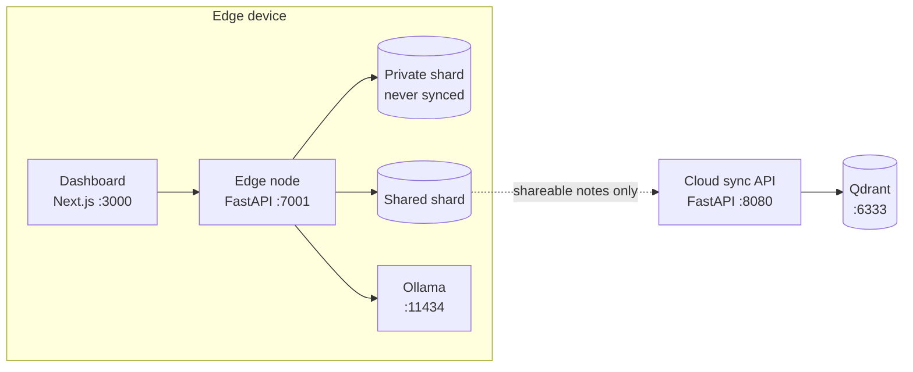

# EdgeVault

[](https://github.com/aaditya3301/edge_vault/actions/workflows/ci.yml)
[](LICENSE)
[](https://www.python.org/)
[](https://nextjs.org/)

**Offline-first knowledge base for field teams. Private by default, intelligent when connected.**

Technicians work in plants, tunnels and substations with no connectivity, and their notes mix
reusable fixes with gate codes and customer details. EdgeVault runs search, an AI privacy gate
and an assistant entirely on the device, and shares only the knowledge that is safe to share
with the rest of the fleet.

## Features

- **Offline hybrid search:** dense embeddings (`bge-small-en-v1.5`) plus BM25, fused with RRF, running on the CPU.
- **AI privacy gate:** deterministic rules catch credentials and personal data first. A local LLM (Ollama) then classifies each note as *shared*, *private* or *temporary*. When the model is unavailable, notes stay private.
- **Physically separate storage:** private and shared notes live in separate Qdrant Edge shards. Only the shared shard can reach the network, and an import contract enforces this in CI.
- **Split and share:** EdgeVault extracts the reusable fact from a private note, with the secret removed, and waits for one-click approval.
- **On-device assistant:** answers come from your notes with numbered citations. An answer built from private notes stays private.
- **Fleet sync:**
  - A durable offline outbox with push-before-pull sync.
  - The on-device AI explains each conflict.
  - Notes are marked *fleet verified* when devices report the same fix independently.
- **Privacy audit:** the cloud rejects anything that isn't shareable, and publicly reports that it holds zero private notes.

## Architecture



## Project structure

```
edge_vault/
├── edge/                     # On-device node
│   ├── edge/                 #   Application: api, gate, memory, store, sync, assistant, llm, privacy
│   ├── tests/                #   Unit and integration tests
│   ├── evals/                #   Model evaluation suites and datasets
│   └── scripts/              #   Model provisioning, seeding, demo and benchmarks
├── cloud/                    # Fleet sync API and its Docker image
├── dashboard/                # Web console (Next.js 14, Tailwind CSS)
├── deploy/edge/              # Edge launcher for Windows field devices
├── .github/workflows/        # CI
├── docker-compose.yml        # Local Qdrant
├── docker-compose.prod.yml   # Production cloud stack
├── Makefile                  # Common tasks
└── requirements.txt          # Python dependencies (includes the edge package)
```

## Getting started

**Prerequisites:**
- Python 3.11+
- Node.js 18+
- Docker
- [Ollama](https://ollama.com) with `ollama pull qwen2.5:1.5b`

**Install**

```bash
python -m venv .venv
source .venv/bin/activate          # Windows: .venv\Scripts\activate
pip install -r requirements.txt
python edge/scripts/provision_models.py
npm --prefix dashboard install
cp .env.example .env
```

**Run** (one terminal each)

```bash
make cloud     # Qdrant + cloud sync API on :8080
make edge-a    # edge node on :7001
make ui-a      # dashboard on http://localhost:3000
```

To see sync between devices, also start a second device: `make edge-b` and `make ui-b` serve it on :7002 and :3001.
Interactive API docs are served at `http://127.0.0.1:7001/docs` for the edge node and `http://127.0.0.1:8080/docs` for the cloud API.
The cloud API's docs are disabled in production.

> On Windows, use `127.0.0.1` rather than `localhost` for the APIs: `localhost` tries IPv6 first and adds ~200 ms to every connection.

## Testing

```bash
make test-unit        # privacy, taint, durability, gate and lifecycle tests (no Ollama needed)
make lint-imports     # import contract: the sync layer can never reach the LLM or private context
make test             # search accuracy and latency
make test-sync        # edge-cloud sync; needs a running cloud API, so use a throwaway one
make eval-gate        # AI gate accuracy (needs Ollama)
make eval-assistant   # assistant citations and refusals (needs Ollama)
make eval-reconcile   # conflict explanations (needs Ollama)
```

## Configuration

Copy `.env.example` to `.env`. The main settings:

| Variable | Default | Purpose |
|---|---|---|
| `DEVICE_ID` | `device-a` | Device identity; its data lives in `data/<DEVICE_ID>/` |
| `AUTHOR` | `Tech A` | Name shown on this device's notes |
| `PORT` | `7001` | Edge API port |
| `SYNC_API_URL` | `http://127.0.0.1:8080` | Cloud sync API |
| `FLEET_API_KEY` | *(empty)* | Bearer token for the cloud API; required in production |
| `OLLAMA_MODEL` | `qwen2.5:1.5b` | Local model for the gate and assistant |
| `QDRANT_URL` | `http://localhost:6333` | Qdrant used by the cloud API |
| `NEXT_PUBLIC_EDGE_API` | `http://127.0.0.1:7001` | Edge API used by the dashboard (set at build time) |
| `NEXT_PUBLIC_CLOUD_API` | `http://127.0.0.1:8080` | Cloud API used by the dashboard (set at build time) |

## Deployment

**Cloud.** This starts Qdrant and the sync API. Qdrant is never exposed, and the API should sit behind an HTTPS reverse proxy.

```bash
cp cloud/.env.production.example cloud/.env.production    # set FLEET_API_KEY, QDRANT_API_KEY, CORS_ORIGINS
docker compose -f docker-compose.prod.yml --env-file cloud/.env.production up -d --build
```

**Edge devices.** Set `SYNC_API_URL` to the HTTPS address of the cloud, and `FLEET_API_KEY`, in `.env`. Then run the
launcher, which checks Ollama and the embedding model before starting the node on loopback only:

```powershell
powershell -ExecutionPolicy Bypass -File deploy\edge\start-edge.ps1
```

## License

[MIT](LICENSE)
